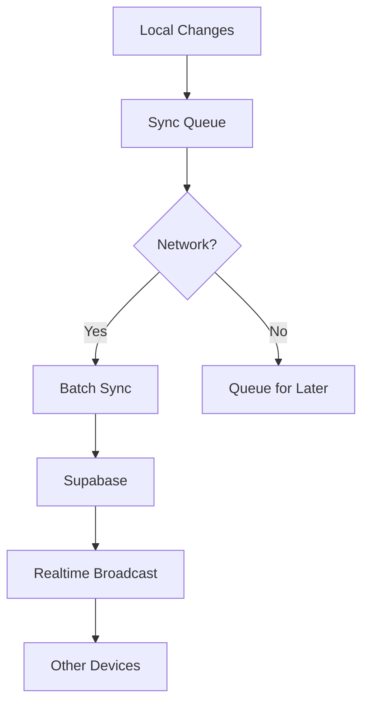

# Supabase Task Sync: Production-Grade Implementation Plan

## 1. Architectural Foundations

### Core Principles
- **Offline-First**: Room as source of truth
- **Minimum Viable Sync**: Track only what changed
- **Battery-Efficient**: Smart batching + backoff



## 2. Critical Components

### 2.1 Sync Tracking Entity
```kotlin
@Entity(tableName = "sync_queue")
data class SyncEntry(
    @PrimaryKey val entityId: String,
    val entityType: String, // "task", "sprint" etc
    val operation: OperationType, // CREATE/UPDATE/DELETE
    val payload: String? = null, // JSON for offline creation
    @ColumnInfo(name = "created_at") val createdAt: Long = System.currentTimeMillis(),
    @ColumnInfo(name = "attempt_count") val attemptCount: Int = 0
)
```

### 2.2 Worker Configuration
```kotlin
// In your DI module
@Provides
@Singleton
fun provideSyncWorkManager(): WorkManager {
    return WorkManager.getInstance(context)
}

@Provides
@Singleton
fun provideSyncConstraints(): Constraints {
    return Constraints.Builder()
        .setRequiredNetworkType(NetworkType.CONNECTED)
        .setRequiresBatteryNotLow(true)
        .build()
}
```

## 3. Implementation Flow

### Phase 1: Local Write Capture
1. Intercept all repository writes
2. Generate sync entries atomically

```kotlin
@Transaction
suspend fun createTaskWithSync(task: Task) {
    taskDao.insert(task)
    syncQueueDao.insert(
        SyncEntry(
            entityId = task.id,
            entityType = "task",
            operation = OperationType.CREATE,
            payload = task.toJson()
        )
    )
}
```

### Phase 2: Background Sync
- Batches 50-100 items per request
- Exponential backoff (10s → 5m)
- Permanent failure handling

```kotlin
class TaskSyncWorker(context: Context, params: WorkerParameters) : CoroutineWorker(context, params) {
    override suspend fun doWork(): Result {
        val batch = syncQueue.getNextBatch()
        return try {
            supabase.from("tasks")
                .upsert(batch.map { it.toTask() })
                .execute()
            
            syncQueue.markSynced(batch.ids)
            Result.success()
        } catch (e: Exception) {
            if (runAttemptCount < MAX_RETRIES) {
                syncQueue.incrementAttempts(batch.ids)
                Result.retry()
            } else {
                Result.failure()
            }
        }
    }
}
```

### Phase 3: Realtime Integration
```kotlin
fun setupRealtimeListener() {
    supabase.realtime.channel("tasks")
        .onPostgresChanges<Task> { change ->
            when (change) {
                is Insert -> handleRemoteInsert(change.record)
                is Update -> resolveConflict(change.record)
                is Delete -> handleRemoteDelete(change.record)
            }
        }
        .subscribe()
}

private fun resolveConflict(remote: Task) {
    val local = taskDao.getById(remote.id)
    when {
        local == null -> taskDao.insert(remote)
        remote.updatedAt > local.updatedAt -> taskDao.update(remote)
        else -> {/* Keep local version */}
    }
}
```

## 4. Security & Performance

### RLS Policy Example
```sql
CREATE POLICY "sync_worker_access" ON tasks
  FOR ALL TO service_role
  USING (true);

CREATE POLICY "user_data_isolation" ON tasks
  FOR ALL USING (auth.uid() = user_id);
```

### Performance Optimizations
- **Batch Size**: 75 items optimal for Supabase
- **Sync Frequency**: Every 15 minutes when charging
- **Payload Compression**: GZIP for large tasks

## 5. Validation Checklist

| Test Case | Success Criteria |
|-----------|------------------|
| Offline Creation | Persists after 5+ restarts |
| Conflict Resolution | Preserves most recent change |
| Battery Impact | <1% per sync cycle |
| Data Consistency | No duplicates/lost items after 100 syncs |

## 6. Implementation Order
1. [ ] SyncEntry entity + DAO
2. [ ] Repository interceptors
3. [ ] WorkManager setup
4. [ ] Supabase batch endpoint
5. [ ] Realtime listeners
6. [ ] RLS policies
7. [ ] Monitoring dashboard

## 7. Key References
- [WorkManager Advanced](https://developer.android.com/develop/background-work/background-tasks/persistent/advanced)
- [Supabase Bulk UPSERT](https://supabase.com/docs/reference/javascript/upsert)
- [Room Transactions](https://developer.android.com/training/data-storage/room/transactions)
